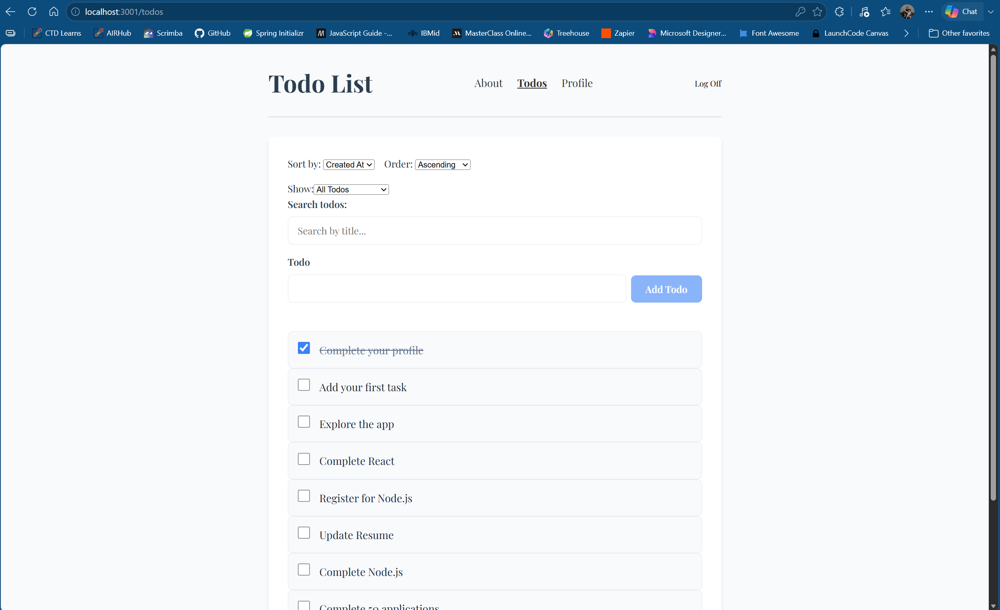
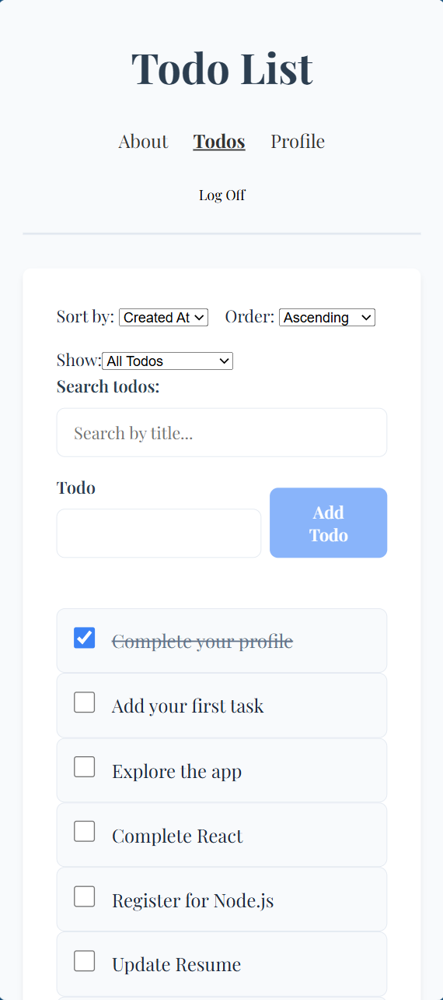

# React Task Management Application

A professional, full-featured Todo application designed to help users effectively manage their daily tasks, stay organized, and maintain productivity through a clean, responsive, and intuitive interface.

## 🔗 Live Demo
[View Live Demo Here](https://your-deployment-link.com)

## ✨ Features
* **Secure Authentication:** Protected routing ensuring only authenticated users can access their tasks.
* **Full CRUD Operations:** Create, read, update, and delete tasks seamlessly.
* **Complex State Management:** Utilizes React's `useReducer` for predictable, centralized state handling.
* **Advanced Filtering & Sorting:** Filter tasks by completion status or text search, and sort by date or alphabetical order.
* **Input Validation & Security:** Client-side sanitization and max-length enforcement to prevent unsafe data entry.
* **Responsive Design:** Fully fluid layout that adapts beautifully to mobile, tablet, and desktop environments.

## 🛠️ Technologies Used
* **Frontend Library:** React 18
* **Routing:** React Router v7
* **Build Tool:** Vite
* **Styling:** CSS Modules
* **Typography:** Google Fonts (Playfair Display, serif)

## 📸 Screenshots

**Desktop View**  


**Mobile View**  


## 🚀 Getting Started

To get a local copy up and running, follow these simple steps.

### Prerequisites
* Node.js (v18 or higher recommended)
* npm (Node Package Manager)

### Installation
1. Clone the repository
   ```sh
   git clone [https://github.com/D-Edwards03/todo-list]

2. Navigate into the directory
   cd https://github.com/D-Edwards03/todo-list

3. Install NPM packages
   npm install

## 📜 Available Scripts
* **npm run dev:** Runs the app in the development mode using Vite. Open http://localhost:5173 to view it in your browser.
* **npm run build:** Builds the app for production to the dist folder. It correctly bundles React in production mode and optimizes the build for the best performance.
* **npm run preview:** Bootstraps a local static web server that serves the files from the dist folder, allowing you to preview the production build locally.

## 🎨 Design Decisions
* **CSS Modules:** I chose to implement CSS Modules and colocate the .module.css files alongside their respective components. This architecture ensures strict style encapsulation, prevents global naming collisions, and makes the codebase highly modular and maintainable.

* **Typography & UI:** The application utilizes the Playfair Display font to achieve an elegant, professional aesthetic. Interactive elements feature distinct hover states, scale transformations, and focus rings to enhance accessibility and user feedback.

* **Custom Hooks:** Implemented custom hooks like useDebounce to optimize performance, preventing excessive re-rendering or API calls during fast text input filtering.

## 🔮 Future Improvements

If given more time, I would like to implement the following features:

* **Drag-and-Drop Reordering:** Allow users to manually prioritize tasks by dragging them into a custom order.

* **Dark Mode Toggle:** Implement a global theme switcher using React Context.

* **Task Categories/Tags:** Allow users to assign colored tags (e.g., Work, Personal, Urgent) to tasks for better organization.

## 📄 License
Distributed under the MIT License. See LICENSE for more information.

## 📬 Contact
GitHub: @D-Edwards03
